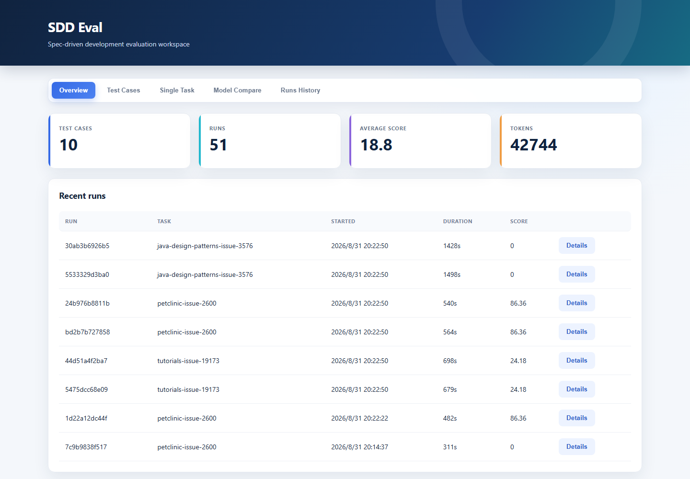
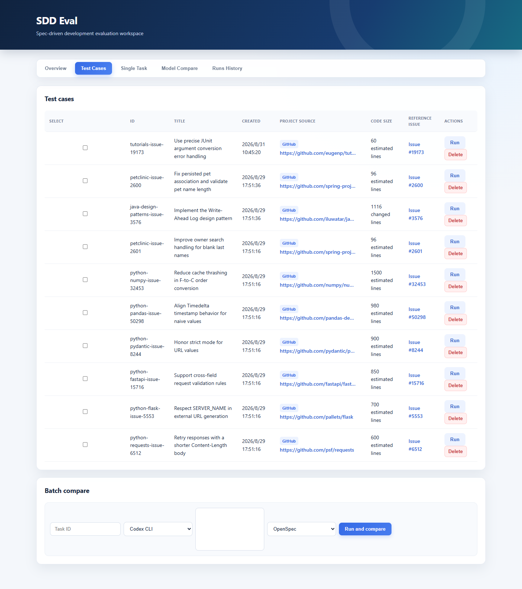
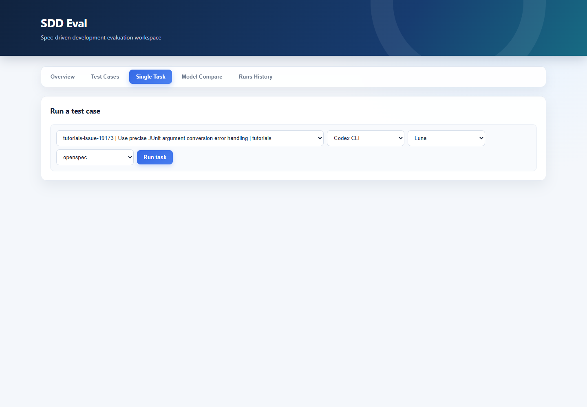
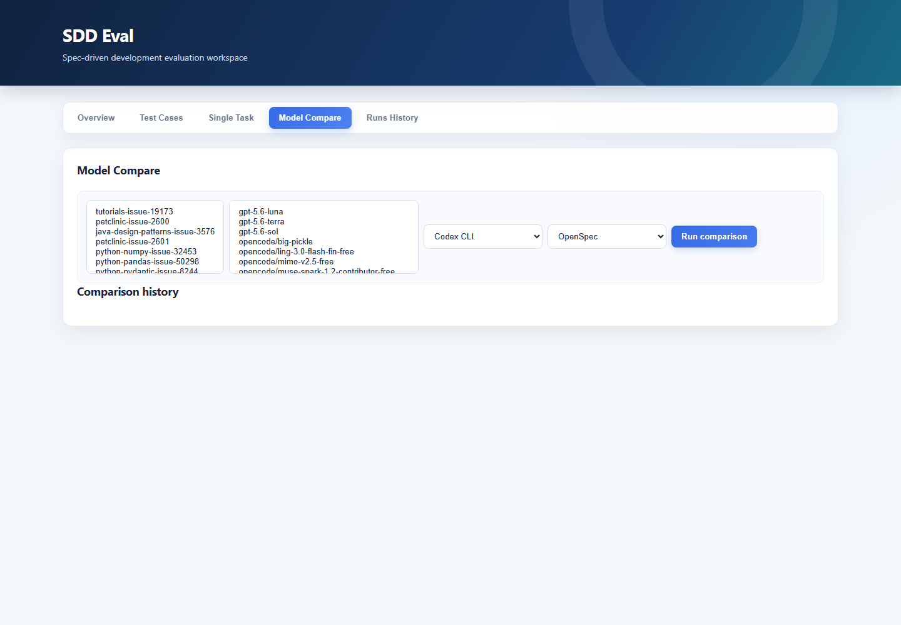
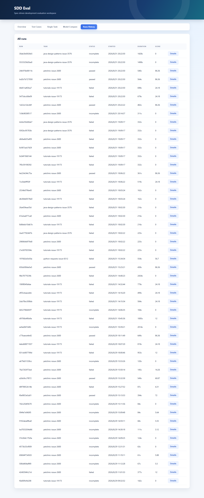
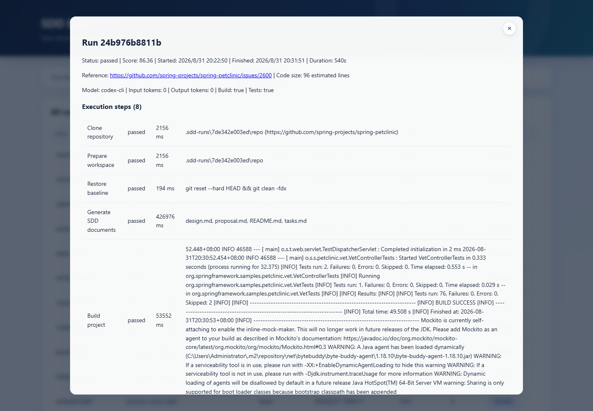

# SDD Eval

SDD Eval 是一个面向 Spec-Driven Development（SDD）的轻量级评测工作台。它将真实项目 Issue 转换为可重复执行的 Test Case，调用不同客户端、模型和 SDD 工作流完成代码生成，并统一保存文档、代码、构建测试证据、Token 使用量和评分结果。



## 核心功能

- **真实任务评测**：Test Case 可关联 GitHub、Gitee 或 GitCode 仓库、Issue、PR 和参考提交。
- **多种 SDD 工作流**：支持 OpenSpec 和 Superpowers 的规格、计划、实现、测试流程。
- **多客户端与模型**：支持 Codex CLI、OpenCode CLI、内置模型名称和 OpenAI-compatible HTTP 服务。
- **单任务运行**：选择一个 Test Case、客户端、模型和 SDD 工作流后发起异步执行。
- **模型横向对比**：对多个 Test Case 和多个模型执行矩阵评测，展示各维度及总分。
- **过程可观测**：运行中持续记录状态、执行步骤、耗时和控制台日志。
- **结果可追溯**：归档生成文档、生成代码、验证结果、评分依据和参考实现信息。
- **本地持久化**：Test Case、运行历史和对比记录保存在 SQLite 中。

## 环境要求

- Python 3.11 或更高版本
- Git
- 执行真实生成任务时，需要安装并登录 Codex CLI 或 OpenCode CLI
- 目标项目所需的构建工具，例如 Maven、Gradle、Node.js 或 Rust

## 快速开始

### 1. 安装

Windows PowerShell：

```powershell
python -m venv .venv
.venv\Scripts\Activate.ps1
python -m pip install --upgrade pip
python -m pip install -e .
```

macOS / Linux：

```bash
python3 -m venv .venv
source .venv/bin/activate
python -m pip install --upgrade pip
python -m pip install -e .
```

### 2. 启动服务

```powershell
sdd-eval serve --host 127.0.0.1 --port 8000
```

如果没有使用 editable install，也可以直接启动 ASGI 服务：

```powershell
python -m uvicorn sdd_eval.api:app --host 127.0.0.1 --port 8000
```

启动后访问：

- 看板：<http://127.0.0.1:8000>
- FastAPI 接口文档：<http://127.0.0.1:8000/docs>

### 3. 导入示例 Test Case

```powershell
sdd-eval import-task examples/tasks/issue-backed-open-source.json
```

刷新看板后，导入的任务会出现在 **Test Cases** 和 **Single Task** 中。

## 看板功能说明

| 页面 | 功能 |
| --- | --- |
| **Overview** | 展示 Test Case 数量、运行次数、平均分、Token 总量和最近运行记录。 |
| **Test Cases** | 查看任务 ID、用途、创建时间、项目来源、参考代码规模和关联 Issue；可快速运行或删除任务。 |
| **Single Task** | 单选一个 Test Case，并选择客户端、模型和 SDD 工作流执行评测。下拉框同时展示任务 ID、用途和所属项目，Task ID 自动取自所选任务。 |
| **Model Compare** | 多选 Test Case 和模型，执行矩阵对比；查看每个任务的分项得分、模型平均分和历史对比记录。 |
| **Runs History** | 查看所有运行的状态、开始时间、耗时和总分，并打开完整运行详情。 |

## 页面截图

### Overview

汇总 Test Case 数量、运行次数、平均分和 Token 使用量，并列出最近八次运行。


### Test Cases

集中展示任务用途、项目来源、代码规模和参考 Issue，并提供快捷运行和删除操作。



### Single Task

通过单选下拉框选择 Test Case，然后配置客户端、模型和 SDD 工作流。



### Model Compare

选择多个 Test Case 和模型执行矩阵评测，并在同一页面查看历史对比结果。



### Runs History

按时间倒序展示全部运行，可查看状态、耗时、得分及详细结果。



### Run 详情

以下为 Run `24b976b8811b` 的详情示例，包括评分、参考任务、构建测试状态和逐步执行记录。



## 操作手册

### 执行单个 Test Case

1. 打开 **Single Task**。
2. 在 Test Case 下拉框中选择任务。选项格式为 `任务 ID | 任务用途 | 项目名`，无需手工输入 Task ID。
3. 选择执行客户端：`Codex CLI` 或 `OpenCode CLI`。
4. 选择模型。
5. 选择工作流：`OpenSpec` 或 `Superpowers`。
6. 点击 **Run task**。
7. 系统创建 Run ID 后会打开详情弹窗，并持续刷新运行状态和执行步骤。

也可以在 **Test Cases** 页面点击目标任务右侧的 **Run**，系统会自动跳转并选中该任务。

### 对比多个模型

1. 打开 **Model Compare**。
2. 在 Test Cases 列表中选择一个或多个任务。
3. 在 Models 列表中选择一个或多个模型；列表项可直接点击切换选中状态。
4. 选择客户端和工作流。
5. 点击 **Run comparison**。
6. 等待状态完成后查看：
   - 每个 Test Case 下各模型的分项得分和总分；
   - 按模型聚合的平均分；
   - Comparison history 中保存的历史对比记录。

一次对比会创建 `Test Case 数量 × 模型数量` 个独立运行。

### 查看运行结果

在 **Overview** 或 **Runs History** 中点击 **Details**，可查看：

- 状态、总分、开始/结束时间和总耗时；
- 模型、输入/输出 Token、构建结果和测试结果；
- 执行步骤及其状态；
- 控制台执行日志；
- Document quality、Code quality、Test quality、Reference comparison、Efficiency 等评分依据；
- 生成的规格/设计文档和代码；
- 参考 Issue、PR 或实现代码规模。

### 使用命令行运行

```powershell
sdd-eval run petclinic-issue-2600 --client codex --model gpt-5.6-luna --tool openspec
```

使用 `--model mock` 可离线检查完整评测管线。Mock 不生成真实实现，因此不会获得代码质量分。

### 编写 Test Case

Test Case 使用 JSON 描述，建议至少包含：

- 稳定且唯一的 `id` 和清晰的 `title`；
- `repository`、`revision` 和目标语言；
- 具体的 requirements 与 acceptance scenarios；
- `build_command` 和可选的 `test_command`；
- 来源 Issue、参考 PR 或 reference commit；
- 必须遵守的 constraints。

可参考 [examples/tasks/issue-backed-open-source.json](examples/tasks/issue-backed-open-source.json)。

### Benchmark V2 数据交换

Benchmark V2 使用独立数据表保存 SWE-bench-compatible 实例、私有 Oracle 和模型 Prediction，不会改变现有 Test Case 与历史 Run。导入 JSON 或 JSONL：

```powershell
sdd-eval import-swebench tasks.jsonl --dataset-id my-dataset --dataset-version v1 --split dev
```

公开导出默认排除 Gold Patch、Test Patch 和测试选择器：

```powershell
sdd-eval export-swebench public-tasks.jsonl --dataset-id my-dataset
sdd-eval export-predictions predictions.jsonl
```

`--include-oracle` 只应由可信管理员用于备份或 Harness 数据准备，不能将其输出提供给 Agent。

可信的本地 Benchmark V2 实例可以先验证 baseline/gold Oracle，再评测已经归档的 Prediction：

```powershell
sdd-eval validate-benchmark owner__repo-123
sdd-eval evaluate-prediction <prediction-id>
```

LocalBackend 会固定检出 `base_commit`，先应用模型 Patch、再应用隐藏 Test Patch，并分别执行 FAIL_TO_PASS 和 PASS_TO_PASS。它会直接执行实例声明的命令，因此只适用于可信仓库；不可信任务必须等待 DockerBackend。

安装 Docker 并为 Benchmark Instance 配置 `docker.image` 后，可使用隔离后端：

```powershell
sdd-eval validate-benchmark owner__repo-123 --backend docker
sdd-eval evaluate-prediction <prediction-id> --backend docker
```

DockerBackend 支持复用本地镜像、显式拉取镜像或使用管理员配置的 Build Context 构建镜像。默认启用资源配额、只读根文件系统、capability 移除和 `no-new-privileges`，并在 Setup 完成后断开 Grading 网络。镜像构建配置不能来自不可信 Agent。

生产执行建议通过持久化队列与独立 Worker，而不是由 Web 进程直接运行：

```powershell
sdd-eval enqueue-benchmark evaluate_prediction owner__repo-123 --prediction-id <prediction-id> --backend docker
sdd-eval benchmark-worker --concurrency 4
```

队列使用 SQLite 原子领取，并记录每次 Attempt。Worker 定期续租；进程异常退出后，过期 Lease 会由下一个 Worker 恢复。失败按 `max_attempts` 重试，取消为协作式取消（最迟在当前 Backend 调用结束后生效）。管理端可使用 `/api/benchmark-jobs` 及其 `cancel`、`retry`、`attempts` 子接口。

## 评分与产物

评测器综合分析规格文档、生成代码、测试结果、参考实现和执行效率。运行产物默认保存在 `.sdd-runs/`，结构化记录保存在 `sdd_eval.db`。这些本地运行数据已被 Git 忽略，不应提交到仓库。

## 配置

使用 OpenAI-compatible HTTP 服务时，可设置：

| 环境变量 | 用途 | 默认值 |
| --- | --- | --- |
| `SDD_EVAL_MODEL` | 默认模型或兼容服务模型名称 | 由调用参数决定 |
| `SDD_EVAL_API_KEY` | 模型服务 API Key | 无 |
| `SDD_EVAL_PROVIDER_RETRIES` | 临时网络错误重试次数 | `3` |

模型选择器也可以直接传入 OpenAI-compatible 服务 URL。真实 Provider 失败时，OpenSpec Adapter 会在可用的情况下回退到工作区感知的 Codex CLI。

> 不要提交 API Key、`sdd_eval.db`、`.sdd-runs/` 或包含敏感信息的执行日志。

## 常见问题

### 页面没有 Test Case

先运行示例导入命令，然后刷新页面：

```powershell
sdd-eval import-task examples/tasks/issue-backed-open-source.json
```

### Run 长时间显示 running

真实运行会克隆项目、调用模型并执行构建测试，耗时取决于仓库规模和模型响应速度。可打开 **Details** 查看最新执行步骤；超过恢复阈值的中断任务会被标记为失败并保留错误信息。

### 客户端不可用

确认对应 CLI 已加入 `PATH`，并在终端中完成登录。可先使用 `--model mock` 验证 SDD Eval 自身流程。

## 开发与测试

```powershell
python -m pytest -q
python -m compileall -q sdd_eval tests
```

## 项目结构

| 路径 | 用途 |
| --- | --- |
| `sdd_eval/` | API、数据模型、Provider、Adapter、评测器、存储和看板 |
| `tests/` | 单元测试与冒烟测试 |
| `examples/tasks/` | 示例 Test Case 目录 |
| `docs/images/` | README 和项目文档使用的截图 |
| `.github/` | CI、Issue/PR 模板和仓库自动化配置 |
| `DEVELOPMENT.md` | 本地开发和架构说明 |

## 更多文档

- [开发指南](DEVELOPMENT.md)
- [Benchmark V2 架构](docs/architecture/benchmark-v2.md)
- [可执行 Oracle 评测协议](docs/architecture/evaluation-protocol.md)
- [Benchmark 安全边界](docs/architecture/security-boundary.md)
- [Benchmark Job 与 Worker](docs/architecture/job-worker.md)
- [贡献指南](CONTRIBUTING.md)
- [安全策略](SECURITY.md)
- [变更记录](CHANGELOG.md)

## License

当前仓库尚未声明开源许可证。在公开发布版本或接受广泛外部贡献前，请先添加许可证。
