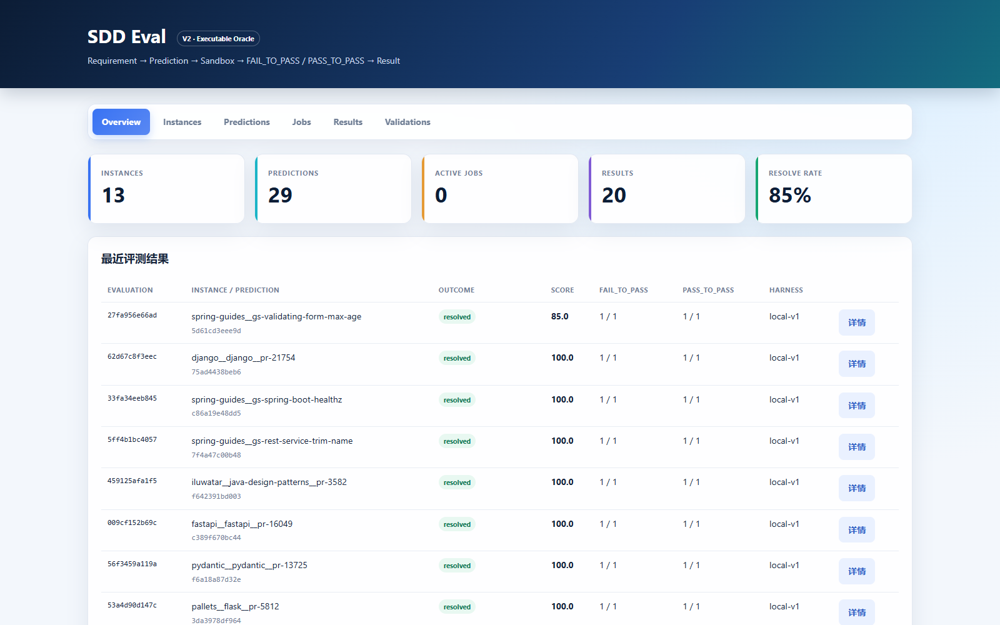
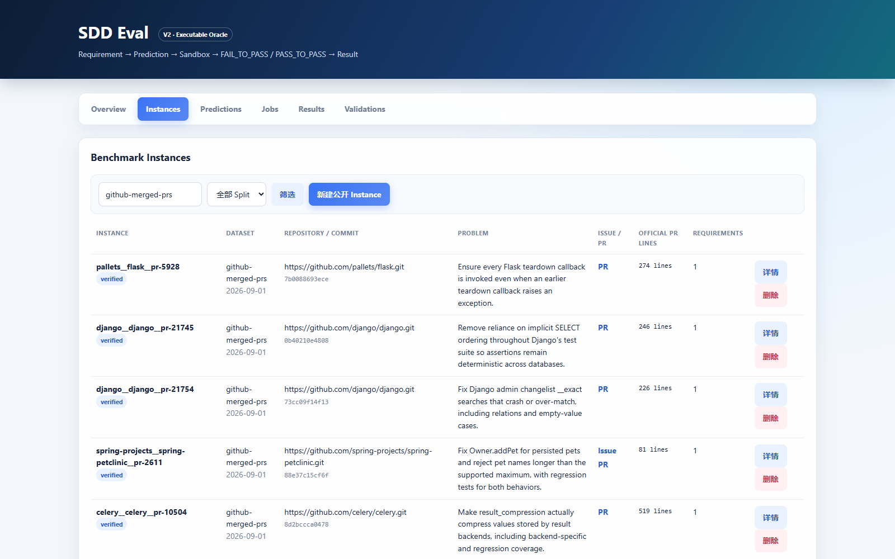
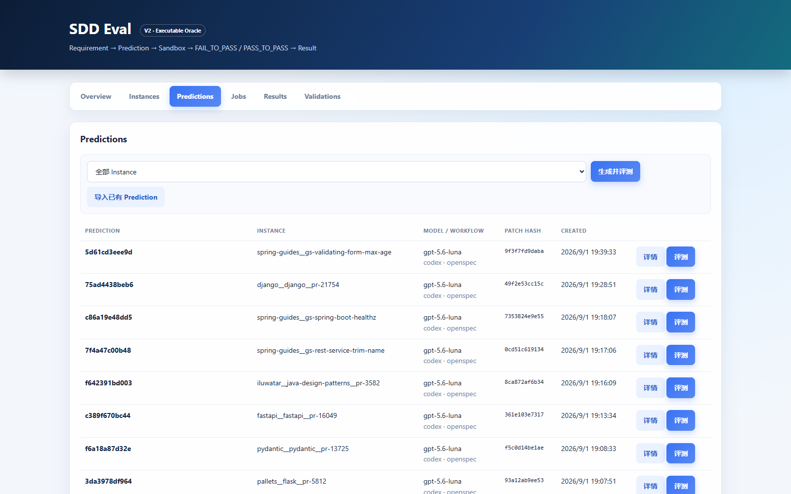
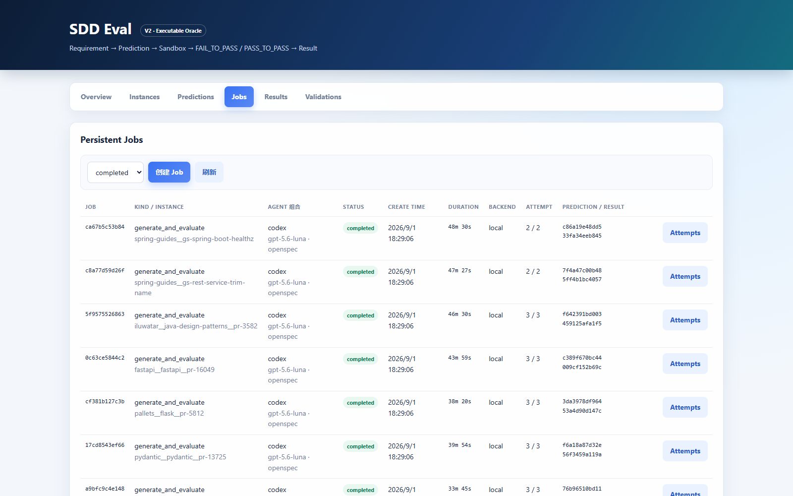
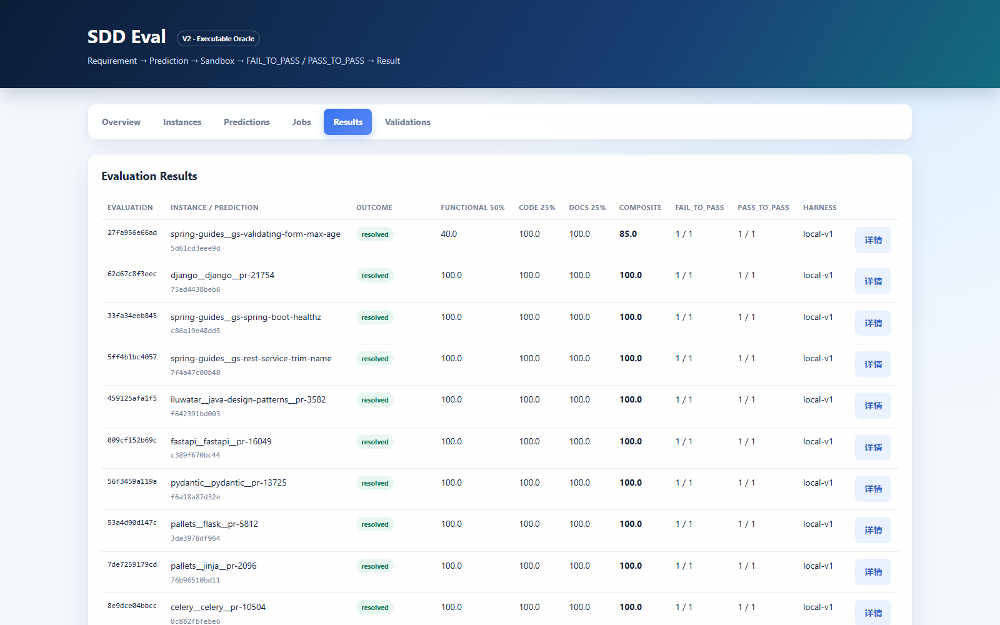
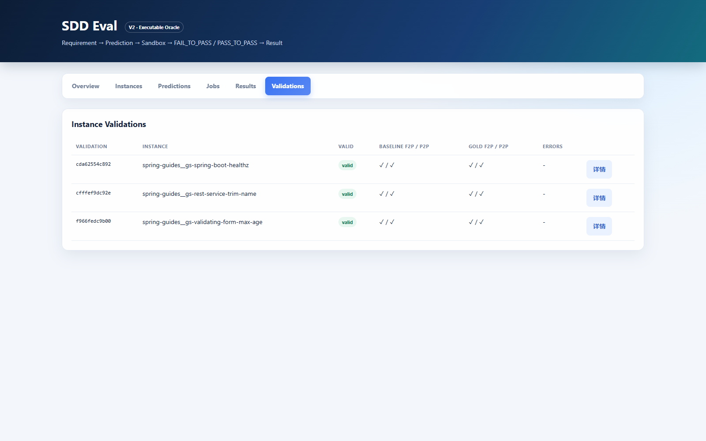

# SDD Eval V2

SDD Eval 是面向 Spec-Driven Development（SDD）Coding Agent 的 SWE-bench-compatible 评测平台。它把公开的仓库、Issue 和固定 `base_commit` 组成 Benchmark Instance，将 Agent 生成的代码 Patch、规格文档和追踪关系归档为 Prediction，再通过可执行 Oracle 在 Local 或 Docker 环境中验证目标行为和回归行为。

V2 只支持可执行 Oracle 协议：公开 Instance 与私有 `EvaluationOracle` 分离，隐藏测试不会进入 Agent 输入、Prediction 或公开导出。结果同时保留 FAIL_TO_PASS / PASS_TO_PASS 明细、执行 Manifest、SDD 产物和 50% 功能 + 25% 代码质量 + 25% 文档质量的 Composite 分数。



> V2 是不兼容升级。旧版 Test Case、Run、Comparison 和旧版工作流适配器不再受支持；首次使用 V2 代码打开旧 SQLite 数据库时会清除旧应用表并重建当前 Schema。

## 核心流程

```text
Benchmark Instance (公开需求、仓库、Base Commit)
        +
Evaluation Oracle (私有 Gold/Test Patch、测试选择器)
        |
        v
Prediction (Agent Patch + SDD Artifacts)
        |
        v
Persistent Job -> Local / Docker Worker
        |
        v
FAIL_TO_PASS + PASS_TO_PASS
        |
        v
Evaluation Result (Resolved / Regression / Failure)
```

## 功能

- SWE-bench-compatible JSON/JSONL 数据导入与导出
- 公开 `BenchmarkInstance` 与私有 `EvaluationOracle` 分离
- Prediction Patch SHA-256 归档和 SDD Artifact/Trace Link 记录
- 固定 `base_commit`、模型 Patch 优先、隐藏 Test Patch 后置的评测协议
- FAIL_TO_PASS 与 PASS_TO_PASS 逐项独立执行
- Local Backend 可信调试与 Docker Backend 隔离评测
- CPU、内存、PID、只读根目录、Capability 和网络隔离策略
- SQLite 持久化 Job、原子领取、Lease、Heartbeat、Attempt、重试和取消
- 通过 Codex/OpenCode 与 OpenSpec/Superpowers 创建 `generate_and_evaluate` Job，自动生成 Prediction 并评测
- 结果按 Functional 50%、Code 25%、Docs 25% 展示加权 Composite 分数
- V2 看板：Instances、Predictions、Jobs、Results、Validations

## 环境要求

- Python 3.11+
- Git
- Docker（评测不可信仓库时必须）
- 使用 Agent 自动生成时需要对应的 Codex CLI 或 OpenCode CLI，以及选定的 SDD 工具
- 目标仓库所需的构建工具（仅 Local Backend）

## 安装与启动

```powershell
python -m venv .venv
.venv\Scripts\Activate.ps1
python -m pip install --upgrade pip
python -m pip install -e .
sdd-eval serve --host 127.0.0.1 --port 8000
```

- 看板：<http://127.0.0.1:8000>
- API 文档：<http://127.0.0.1:8000/docs>

## 导入 Benchmark 数据

输入记录遵循 SWE-bench 核心字段：

```json
{
  "instance_id": "owner__repo-123",
  "repo": "owner/repo",
  "base_commit": "0123456789abcdef",
  "problem_statement": "Issue description",
  "patch": "gold patch",
  "test_patch": "hidden test patch",
  "FAIL_TO_PASS": ["test_target_behavior"],
  "PASS_TO_PASS": ["test_existing_behavior"]
}
```

导入：

```powershell
sdd-eval import-dataset tasks.jsonl my-dataset --dataset-version v1 --split verified
```

字段示例见 [`examples/datasets/demo-swebench.jsonl`](examples/datasets/demo-swebench.jsonl)；其中仓库和提交值仅用于展示格式，执行前应替换为真实可检出的来源。

公开导出默认排除 Gold Patch、Test Patch 和测试选择器：

```powershell
sdd-eval export-dataset public.jsonl --dataset-id my-dataset
sdd-eval export-dataset private-backup.jsonl --dataset-id my-dataset --include-oracle
```

`--include-oracle` 只用于可信管理员备份，不能将输出交给 Agent。

## Prediction

通过 API `POST /api/predictions`、看板或 JSONL 文件归档模型 Patch：

```json
{
  "instance_id": "owner__repo-123",
  "model_name_or_path": "coding-agent",
  "client": "codex",
  "workflow": "sdd",
  "model_patch": "diff --git ...",
  "artifacts": {
    "documents": {"spec.md": "...", "design.md": "..."},
    "trace_links": []
  }
}
```

```powershell
sdd-eval import-predictions predictions.jsonl
sdd-eval export-predictions archived-predictions.jsonl
```

看板的 Predictions 页还可以直接选择客户端、模型和 SDD 工作流，创建 `generate_and_evaluate` Job。Worker 只向 Agent 提供公开 Instance，生成文档和代码 Patch 后再使用私有 Oracle 执行评测。

### Spring Boot 全流程示例

仓库附带一个可复现的 Spring Guides 种子脚本。它会从 GitHub codeload 获取三个官方小项目，在 `.sdd-bench-repos/` 创建本地固定快照，并导入 Instance、私有 Oracle、Gold Prediction、Validation Job 和 Evaluation Job：

```powershell
python scripts/seed_spring_guides.py
python -c "from sdd_eval.worker import run_workers; run_workers('sdd_eval.db', 6, 600, 1, True)"
```

这组任务覆盖健康检查端点、REST 参数规范化和 Bean Validation 年龄上限。由于本地快照会执行 Maven Wrapper，首次运行需要访问 Maven Central 下载依赖；源码快照和依赖缓存不提交到 Git。

## 验证与评测

发布数据集前验证 Baseline 和 Gold Oracle：

```powershell
sdd-eval validate-instance owner__repo-123 --backend docker
```

直接评测 Prediction：

```powershell
sdd-eval evaluate <prediction-id> --backend docker
```

Local Backend 会直接执行 Instance 中声明的命令，只能用于可信仓库：

```powershell
sdd-eval validate-instance owner__repo-123 --backend local
sdd-eval evaluate <prediction-id> --backend local
```

## 持久化队列与 Worker

生产环境应创建 Job 并由独立 Worker 执行：

```powershell
sdd-eval enqueue validate_instance owner__repo-123 --backend docker
sdd-eval enqueue evaluate_prediction owner__repo-123 --prediction-id <prediction-id> --backend docker
sdd-eval worker --concurrency 4
```

Worker 使用 SQLite 原子领取任务，执行期间持续更新 Lease 和 Heartbeat。Worker 异常退出后，过期 Attempt 会标记为 `expired`，任务在剩余次数内重新排队。运行中取消属于协作式取消，最迟在当前 Backend 调用结束时生效。

## 看板

| Tab | 内容 |
| --- | --- |
| Overview | Instance、Prediction、活跃 Job、Result 和 Resolve Rate |
| Instances | 数据集、仓库、Base Commit、Issue 和 Requirement IR |
| Predictions | 模型、工作流、Patch Hash、Patch 和 SDD Artifacts |
| Jobs | 状态、Backend、Attempt、Worker、Result、取消与重试 |
| Results | Outcome、FAIL_TO_PASS、PASS_TO_PASS 和执行 Manifest |
| Validations | Baseline/Gold 验证结果和错误日志 |

## 看板截图

以下截图来自当前 V2 看板的实际运行页面，数据仅用于展示界面和字段：

### Instances

按数据集和 Split 筛选公开 Instance，查看仓库、Base Commit、Issue/PR、官方变更行数和 Requirement 数量。



### Predictions

归档模型 Patch 和 SHA-256 Hash，查看客户端、模型、工作流，并从已有 Prediction 快速发起评测。



### Jobs

查看 `generate_and_evaluate`、`evaluate_prediction` 和 `validate_instance` 的状态、Backend、Attempt、耗时以及关联的 Prediction/Result。



### Results

对比 Functional、Code、Docs 三个分项和加权 Composite，同时查看 FAIL_TO_PASS、PASS_TO_PASS 通过数与 Harness 版本。



### Validations

发布数据集前检查 Baseline 和 Gold Oracle 是否满足目标失败、回归通过、Gold Patch 可应用及完整通过条件。



## API

主要接口：

- `/api/summary`
- `/api/instances`
- `/api/predictions`
- `/api/generations`
- `/api/jobs`
- `/api/jobs/{id}/attempts`
- `/api/results`
- `/api/validations`

Oracle 没有公开 HTTP Route。通过 `/api/jobs` 创建的评测 Job 强制使用 Docker Backend；`generate_and_evaluate` 可通过看板或 `/api/generations` 提交，但选择 Local 时只能用于可信仓库。完整请求结构以 `/docs` 生成的 OpenAPI 文档为准。

## 开发验证

```powershell
python -m pytest -q
python -m compileall -q sdd_eval tests
git diff --check
```

## 项目结构

| 路径 | 用途 |
| --- | --- |
| `sdd_eval/models.py` | V2 数据契约 |
| `sdd_eval/storage.py` | V2 Schema 和持久化 Job 调度 |
| `sdd_eval/benchmark_io.py` | SWE-bench 数据交换 |
| `sdd_eval/harness.py` | 可执行 Oracle 协议 |
| `sdd_eval/docker_backend.py` | Docker 隔离实现 |
| `sdd_eval/worker.py` | 独立 Worker |
| `sdd_eval/api.py` | V2 HTTP API |
| `sdd_eval/dashboard.html` | V2 看板 |
| `docs/images/` | README 看板截图 |
| `tests/` | Schema、Harness、Docker 和 Job 测试 |

## 文档

- [开发者指南](DEVELOPMENT.md)
- [V2 架构](docs/architecture/benchmark-v2.md)
- [可执行 Oracle 协议](docs/architecture/evaluation-protocol.md)
- [安全边界](docs/architecture/security-boundary.md)
- [Job 与 Worker](docs/architecture/job-worker.md)
- [贡献指南](CONTRIBUTING.md)
- [安全策略](SECURITY.md)

## License

当前仓库尚未声明开源许可证。在公开发布或接受广泛外部贡献前，请先添加许可证。
