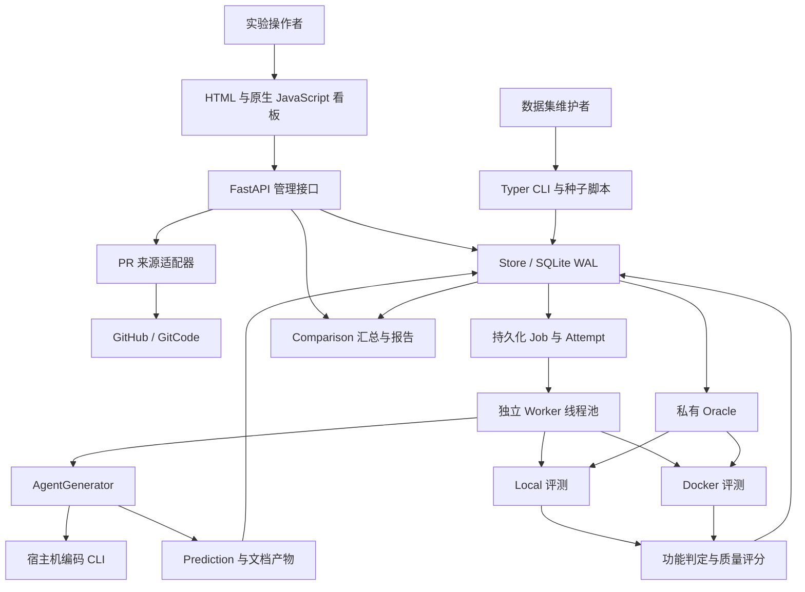
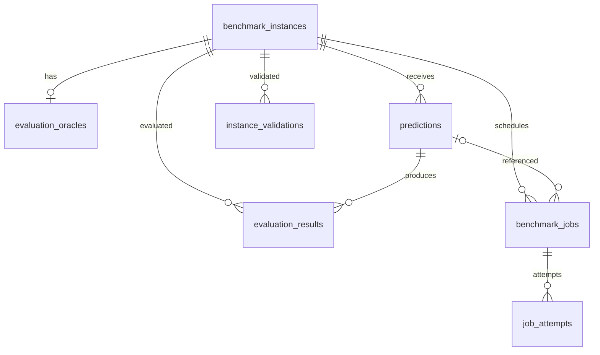
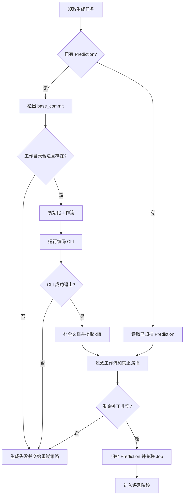
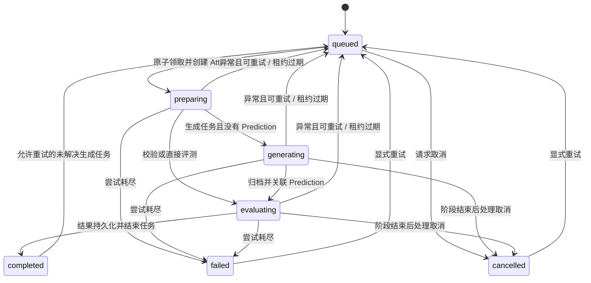

# SDD Eval 项目设计说明书

## 1. 文档范围与结论

本文基于当前仓库源码、测试、配置及 `docs/architecture/` 文档，分析 SDD Eval 的总体架构、领域模型、执行协议、任务调度、质量评分、接口、前端、部署及设计风险。本文描述已实现行为；标注为“建议”的内容尚未实现，不能视为系统承诺。

分析日期：2026-09-07。仓库提交基线：`1a14308`（Document PR sources and dashboard assets）。软件版本：`2.0.0`；公开 Instance 协议版本默认 `2`；SQLite 内部 Schema 版本 `3`，三者用途不同。

分析期间工作区的 `sdd_eval/harness.py` 和 `sdd_eval/storage.py` 出现了并行修改，本文已复核其中的构建重试与重新生成逻辑，以复核时的工作区为准。本次工作仅新增本说明书，不修改业务实现，不读取现有业务数据库中的私有 Oracle 或运行凭据。代码证据使用“相对路径 + 行号 + 函数名”，便于定位；后续源码修改可能导致行号漂移。

### 1.1 总体判断

项目是面向规格驱动开发 Agent 的评测与实验管理平台。它把公开任务、模型提交和私有裁判分开，使用真实仓库、补丁和可执行测试判定功能是否解决，再附加代码、文档与效率评价。

架构形态是“模块化单体代码库 + 独立 Worker 进程 + 单机 SQLite 队列”。其优势在于依赖少、部署直接、结果可追溯、长任务不占用 HTTP 请求生命周期。当前更适合可信团队内部的单机实验和数据集整理，尚不能直接视为具备完整隔离、公平排名和高可用保障的多租户评测服务。

影响可信度的关键设计边界如下：

| 关注点 | 已实现 | 必须保留的限制 |
| --- | --- | --- |
| 功能裁决 | 模型补丁、隐藏测试、构建、两组测试逐项执行 | 测试退出码是判据，判据本身的业务有效性依赖 Oracle 质量 |
| 数据保密 | Instance 与 Oracle 分表，生成器不接收 Oracle 对象 | 结果接口返回测试选择器与执行输出，不能当作无泄漏的 Agent 公共接口 |
| 执行隔离 | Docker 评测有资源限制、默认断网及能力裁剪 | Agent 生成仍在宿主机，P3C 自定义命令也可能在宿主机执行 |
| 持久化调度 | 原子领取、心跳、租约回收、Attempt 历史 | 至少一次执行；结果写入与完成任务不是同一事务 |
| 模型排名 | 按模型汇总最新 Prediction 评测结果 | 无结果的失败任务不进入均分分母；批次不是不可变实验快照 |
| 工程质量 | 确定性文档检查、补丁规则、可配置 lint/coverage | 关键词和路径匹配不等于语义验证或完整设计审查 |

## 2. 目标、角色与业务边界

### 2.1 核心目标

1. 将仓库、固定提交、问题描述和需求组织为统一 Benchmark Instance。
2. 归档模型生成的代码补丁、规格/设计/任务文档及 Token 使用信息。
3. 在固定基线下验证目标问题得到修复，且指定的已有行为没有回归。
4. 支持多模型与多实例组合实验，提供进度、结果明细及可导出报告。
5. 通过独立校验流程检查数据集 Oracle 是否能区分原始版本与参考修复。

概念上存在数据集维护者、实验操作者、Agent、评测执行者与报告读者。这些是业务角色，并非已经实现的用户身份或 RBAC 角色；当前模型没有用户、租户、权限或资源所有者字段。

### 2.2 不应误读的边界

“SWE-bench-compatible”指支持核心 JSON/JSONL 字段和补丁评测思路，不代表无需环境适配即可运行任意 SWE-bench 数据集。导入器没有把所有 `owner/repo` 自动转换为 Git URL，Harness 会直接将 `instance.repo` 传给 Git，数据维护者必须提供当前环境可访问的仓库地址。

平台能调用现有编码 CLI，但没有统一模型推理服务或独立模型计费系统。OpenSpec 有实际初始化命令；CodeSpec 与 Superpowers 当前主要由目录约定和提示词落实流程，并未表现为三个对等的工作流引擎。

证据：`benchmark_io.py:54 from_swebench_record`、`generator.py:42 _checkout`、`generator.py:97 _prepare_workflow`。

## 3. 总体架构

### 3.1 组件关系



上述箭头表达依赖或数据流；Jobs、Prediction、Oracle 并非独立部署的服务。它们主要是 SQLite 内的持久化实体。

### 3.2 技术栈与部署单元

| 层次 | 实现 | 设计作用 |
| --- | --- | --- |
| 运行时 | Python ≥ 3.11 | 执行业务编排和外部进程调度 |
| HTTP | FastAPI、Uvicorn | 请求校验、管理接口、静态资源与 OpenAPI |
| 契约 | Pydantic v2 | 数据解析、默认值及跨字段校验 |
| 命令入口 | Typer | 数据导入、直接评测、入队、Worker、服务启动 |
| 持久化 | 标准库 sqlite3 + JSON 文本 | 业务记录与持久化任务队列 |
| 外部数据 | 同步 httpx.Client | PR 查询和导入 |
| 执行 | Git、subprocess、Docker/WSL | 拉取基线、运行 Agent、执行构建与测试 |
| 展示 | HTML、CSS、原生 JavaScript | 轮询状态、弹窗详情、批次报告 |

项目没有独立前端构建链、ORM、Redis、Celery 或专用消息代理。API 路由使用同步 `def`；长时评测交给 Worker，但 PR 查询和模型目录探测仍在 API 请求处理期间执行。模型目录探测最多等待 20 秒，非空结果缓存 60 秒。

证据：`pyproject.toml`、`api.py:27 _opencode_models`、`api.py:148 search_source_repositories`。

### 3.3 模块职责与耦合

| 模块 | 主要职责 | 关键依赖与设计评价 |
| --- | --- | --- |
| `models.py` | 领域契约与校验 | 大部分模块共同依赖，是接口兼容性的中心 |
| `storage.py` | Schema、CRUD、调度状态机 | 同时承担数据访问与队列业务逻辑，便于事务控制但职责较集中 |
| `benchmark_io.py` | SWE-bench 字段转换 | 将公开字段与 Oracle 拆分，屏蔽交换格式差异 |
| `pr_sources.py` | 仓库/PR 查询、diff 重建、初始 Oracle | 来源解析集中；业务判据强度仍需人工提升 |
| `generator.py` | 工作流准备、CLI 调用、产物提取 | 与具体 CLI 参数、模型别名、工作流目录有直接耦合 |
| `harness.py` | 检出、补丁、测试、分类与结果构造 | 同时是 Local 实现和 Docker 复用的协议基类 |
| `docker_backend.py` | 容器生命周期及隔离执行 | 继承 Local，通过覆写执行阶段复用评分；两种顺序容易分叉 |
| `quality.py` | 文档、Java 静态规则与命令结果评分 | 大部分函数可独立测试，自定义 P3C 命令执行仍混在评分模块中 |
| `worker.py` | 领取、续租、生成、评测、归档 | 接受 Backend/Generator 工厂，便于替换外部边界 |
| `comparison.py` | 模型汇总与矩阵 | 纯数据计算，适合进一步独立为报表服务 |
| `api.py` | 路由、入队校验、批次组装、HTML 报告 | 业务编排与表现层混合，重复批次过滤逻辑较多 |
| `cli.py` | 本地管理入口 | 与 API 有部分重复校验及 Backend 选择逻辑 |
| `dashboard.html/js` | 看板结构、交互和轮询 | 无框架依赖；遗留代码与内联事件增加维护成本 |

建议在保持单体部署的前提下，提取统一应用服务层、Backend 协议和执行器接口；无需为当前规模直接拆成微服务。

## 4. 领域模型与数据设计

### 4.1 核心实体

| 实体 | 核心数据 | 生命周期和约束 |
| --- | --- | --- |
| `BenchmarkInstance` | 实例 ID、仓库、base_commit、问题、需求、环境、数据集与公开来源 | 可通过同 ID upsert 更新；版本字段未形成不可变版本管理 |
| `RequirementIR` | ID、描述、类型、优先级、验收条件、引用 | 需求可为功能、安全、并发、可用性等；优先级 must/should/could |
| `EvaluationOracle` | gold_patch、test_patch、F2P/P2P、禁止路径、质量策略 | 每实例当前一条；只能靠管理流程保证保密与版本正确 |
| `Prediction` | 模型、客户端、工作流、补丁、Hash、ArtifactBundle、TokenUsage | ID 默认 12 位 UUID 十六进制；补丁 Hash 是准确 UTF-8 字节的 SHA-256 |
| `ArtifactBundle` | documents、trace_links、logs | 文档正文与日志内嵌存储，无对象存储引用或容量上限 |
| `EvaluationResult` | outcome、resolved、三项分数、用例明细、质量发现、环境摘要 | 一次评测一条结果；允许同 Prediction 多次评测 |
| `InstanceValidationResult` | Baseline/Gold 各项布尔值、errors、logs | 多条历史记录，按时间获取最新 |
| `BenchmarkJob` | kind、backend、状态、attempt、租约、prediction_id、result_id、batch_id | 当前状态与执行配置；不是完整事件日志 |
| `JobAttempt` | job_id、attempt、worker_id、状态、心跳、错误与结果 ID | ID 为 `job_id:attempt`，用于追踪领取历史 |

`Prediction.model_post_init` 校验调用方提供的 Hash 与补丁是否一致。`EvaluationResult.validate_outcome` 校验 resolved 与 outcome 一致，且已通过数不超过总数，但不验证“resolved 必须 build_passed 且全部测试通过”。这类语义主要由 Harness 维持，绕过 Harness 构造对象不能得到相同保证。

`BenchmarkJobCreate` 对评测任务要求 prediction_id，对校验任务禁止 prediction_id，对生成任务要求 client/model/workflow。普通字符串字段并非普遍配置非空、长度与字符集限制；`schema_version` 也是普通整数，默认值不等于强制版本校验。

证据：`models.py:90 BenchmarkInstance`、`:134 Prediction`、`:160 EvaluationResult`、`:266 BenchmarkJobCreate`。

### 4.2 物理表和关联



| 表 | 关系型列 | JSON 内容与索引 |
| --- | --- | --- |
| `schema_metadata` | key PK、value | 内部版本号 |
| `benchmark_instances` | id PK、dataset_id、split、created_at | data 保存完整 Instance；dataset/split 无单独索引 |
| `evaluation_oracles` | instance_id PK/FK、created_at | data 保存私有 Oracle |
| `predictions` | id PK、instance_id FK、patch_hash、created_at | instance 与 patch_hash 索引；Hash 非唯一 |
| `evaluation_results` | id PK、prediction_id FK、instance_id FK、outcome、created_at | prediction 与 instance 索引 |
| `instance_validations` | id PK、instance_id FK、valid、created_at | `(instance_id, created_at)` 索引 |
| `benchmark_jobs` | id PK、instance_id FK、prediction_id FK、status、available_at、lease_expires_at、created_at、updated_at | `(status, available_at, created_at)` 领取索引；batch_id 在 JSON 中 |
| `job_attempts` | id PK、job_id FK、attempt、status、created_at | `(job_id, attempt)` 索引 |

这种“查询列 + 完整 JSON”结构能快速扩展字段，但每次读取通常要反序列化整个对象，大日志与大补丁会放大 IO 和内存开销。双份字段必须由 Store 写入函数同步，直接改 SQL 容易导致 JSON 与索引列不一致。

`result_id` 是可指向 Evaluation 或 Validation 的逻辑引用，没有数据库外键。数据库也未使用复合外键保证 Result 的 instance_id 与 Prediction 所属实例一致。Instance+Oracle 联合写入没有显式校验两者 ID 相等；当另一个实例已存在时，仅靠外键不足以阻止错误关联。

证据：`storage.py:38 _initialize`、`:97 put_benchmark_instance`、`:163 put_evaluation_result`、`:250 _write_job`。

### 4.3 事务和数据生命周期

Store 每次建立连接启用 WAL、外键和 30 秒 busy timeout。WAL 允许读写更好地并行，但仍只有一个写事务持有写锁。多数方法使用 `with self.conn()` 管理提交与回滚；sqlite3 连接上下文并不等同于显式关闭连接，建议统一封装连接释放，避免依赖对象回收。

Instance 与 Oracle 在一次 `put_benchmark_instance` 中事务写入。整个数据集逐条提交，整个 Comparison 也逐个 Job 提交，没有跨记录批量原子性。Comparison 的“先全部校验再写入”只能避免输入错误导致部分创建，不能防止中途数据库错误或进程退出。

Instance 删除通过外键级联影响 Oracle、Prediction、Result、Validation、Job 和 Attempt。它是删除全部实例历史的操作，当前没有软删除、回收站或运行中任务保护。

Schema 版本缺失或不等于 3 时，初始化代码尝试删除数据库中除 `sqlite_sequence` 外的所有已有表，再建表。它不是迁移机制，甚至不只针对 `V2_TABLES` 集合中的表。API 模块导入时即执行 `Store()`；CLI `serve --db` 先导入 API 再替换 Store，因此指定其他数据库并不消除默认数据库的初始化副作用。

建议将数据库初始化移入显式启动流程；版本不匹配应失败并要求执行版本化迁移。当前部署必须备份后升级，不能把启动应用当作无副作用的连通性检查。

### 4.4 可复现性

已有锚点包括 base_commit、patch_hash、environment_digest、harness_version 和 Docker image ID。仍缺少将 Oracle 内容 Hash、Oracle 版本、评分策略版本、完整运行配置、实际依赖清单绑定到 Result 的不可变快照。

Local 环境摘要主要取配置，不能证明宿主机工具链或依赖版本一致。Docker 摘要不包含所有有效参数，例如 user、dependency_cache_key 未进入 Manifest；共享可写缓存会进一步影响复现。父类 evaluate 在执行前计算环境摘要，而 Docker 可能随后拉取或构建镜像，最终 Manifest 与早先摘要也可能不对应同一镜像状态。

当前没有基于内容的结果缓存或自动去重；patch_hash 索引只是查询能力。建议未来缓存键至少包含实例版本、提交、补丁 Hash、Oracle Hash、镜像/环境摘要、Harness 和评分策略版本。

证据：`harness.py:68 environment_digest`、`:369 evaluate`；`docker_backend.py:90 execution_manifest`、`:105 environment_digest`、`:273 evaluate`。

## 5. 数据集与 PR 导入设计

### 5.1 JSON/JSONL 数据交换

导入流程为读取整个文件、解析记录、转换 Instance/Oracle、逐对保存。必填源字段为 instance_id、repo、base_commit、problem_statement；没有需求时自动补 `REQ-1`。测试选择器支持数组、JSON 编码数组及单个字符串。

`patch` 进入 gold_patch，`test_patch` 进入私有测试补丁，`FAIL_TO_PASS/PASS_TO_PASS` 进入私有选择器。公开导出不包含这些字段；显式 `include_oracle=True` 才输出私有数据。`--include-oracle` 的管理员属性是操作约定，CLI 没有身份校验。

官方代码变更量优先使用来源提供的统计，也可从 gold_patch 的增删行推导，排除 diff 文件头。这个数是参考变更规模，不是代码复杂度、模型工作量或实现正确性指标。

公开导出保留 RequirementIR 全部字段，其中含 `oracle_refs`，所以维护者仍需避免将隐藏测试信息写入公开需求引用。导入器也不是所有导出字段的精确往返：dataset/split/version 参数由本次导入配置决定，created_at 等字段会重新生成。

证据：`benchmark_io.py:23 read_records`、`:54 from_swebench_record`、`:148 _swebench_record`；`storage.py:73 _backfill_reference_code_lines`。

### 5.2 PR 来源适配

`PullRequestSourceService` 统一 GitHub 与 GitCode 的仓库搜索、已合并 PR 列表和导入。GitHub 使用 diff 媒体类型读取补丁；GitCode 从文件级 hunk 重建统一 diff。变更规模分组是 `<500`、`500–1500`、`>1500`，对应 `under_500/500_to_1500/over_1500`。

客户端默认 30 秒超时，可读取对应来源 Token。列表查询会逐条补取 PR 详情，形成 N+1 网络请求；未见分页遍历、指数退避、熔断或专门处理 Retry-After。403 被统一描述为 Token 问题，可能无法准确表达限流原因。

API 导入前检查重复实例并返回 409，但“查询后写入”不是数据库原子防重；并发请求仍可在相同检查之后 upsert 同一实例。

### 5.3 自动 Oracle 的实际强度

通用 `_smoke_oracle` 选取 PR 中一条新增源码行，生成两个 Python 脚本：目标检查断言该文件包含该行，回归检查仅断言 `.git` 目录存在。此设计能快速验证补丁链路，却不能证明业务行为符合需求：等价实现可能不包含指定行而失败，包含指定行的错误实现也可能通过。

PR 导入后默认 `split=dev`，没有自动执行 Baseline/Gold 校验，没有自动配置 Docker 镜像，Oracle 的 forbidden_paths 也未显式填入 `.sdd_eval_tests/**`。因此“导入成功”不代表“可直接 Docker 评测”或“已验证的正式样本”。生成器默认排除隐藏测试目录，但直接提交 Prediction 的保护仍依赖 Oracle 禁止路径。

种子脚本有区别：`seed_github_prs.py` 针对部分已知 PR 提供行为级 Oracle，其余可退回源码标记检查；`seed_spring_guides.py` 构建本地 Spring Guides 快照，并入队验证与参考评测。Spring 快照首次来自 main 分支压缩包，后续固定本地提交，不代表跨时间重新运行一定获得相同上游内容。种子脚本有删除/重建实例的逻辑，本次分析未执行它们。

建议增加 `oracle_kind=behavioral/source_marker` 与校验状态，只将通过 Baseline/Gold 且达到行为判据要求的样本纳入正式排行榜。不要仅凭 split 字符串认为样本已完成质量认证。

证据：`pr_sources.py:69 _smoke_oracle`、`:202 import_pull_request`；`scripts/seed_github_prs.py:195 oracle_test_patch`、`:223 functional_oracle`；`scripts/seed_spring_guides.py:203 prepare_repository`、`:226 main`。

## 6. Agent 生成与产物设计

### 6.1 生成阶段



生成器使用 depth=1 拉取指定提交，关闭 LFS smudge，不拉取完整历史。工作目录通过 resolve 后校验必须位于仓库内。Prompt 包含问题、需求、约束、目录范围与设计审查要求；不接收 EvaluationOracle。

OpenSpec 执行 `init` 和 `new change`。CodeSpec/Superpowers 创建对应目录并通过 Prompt 要求规格、计划和实现。生成 CLI 超时固定为 7200 秒，独立于 Worker 租约。Codex 调用含硬编码 `relay` profile 及跳过审批/沙箱参数；OpenCode 调用 `run --auto`。这描述的是仓库实现，不代表本次分析执行了这些命令。

### 6.2 补丁和文档归档

生成后 `_ensure_documents` 为缺失/空白文档写入模板，部分 tasks 模板预设已完成，design 中可能仍有 TODO。因此 ArtifactBundle 中的文档不能全部归因于 Agent 主动完成的设计工作，文档存在也不能证明实现与验证完成。

`_patch` 先对范围执行 `git add -N`，再读取 `git diff --binary`；排除工作流、CLI 配置与隐藏测试目录。后续 `_filter_patch` 按 `diff --git` 段过滤，Worker 再根据私有 forbidden_paths 删除禁止路径。自动生成任务与直接提交任务语义不同：前者可能自动剔除受保护改动，后者由 Harness 判为 invalid_patch。

补丁来自当前工作树相对索引的差异。若 Agent 自行提交或将修改完全暂存，当前提取方式可能遗漏修改；复杂带引号路径、重命名或特殊 diff 需要更完善解析。建议直接对固定 base_commit 获取最终变更，使用 Git 结构化路径输出，并同时记录原始补丁 Hash、过滤后 Hash 和过滤原因。

生成器收集对应工作流目录下全部 Markdown，但没有解析结构化 TraceLink 文件，返回的 trace_links 默认空列表。这使严格需求追踪通常只能获得 partial，即使文档中提到了需求和实现路径。

证据：`generator.py:116 _agent_command`、`:204 _documents`、`:214 _ensure_documents`、`:243 _patch`、`:281 _filter_patch`、`:294 generate`；`worker.py:35 run_once`。

### 6.3 效率统计

OpenCode 从 step_finish 统计 input/cache read/cache write 及 output/reasoning；Codex 从 turn.completed 读取用量，旧文本输出有 total-only 回退。estimated 标识无法精确读取的情况。

latency_ms 覆盖生成器从检出到收集产物的时间，不是纯模型推理延迟，也不包含后续评测耗时。报表总 Token 基于有结果的 Prediction，用量不包含生成失败、被替换的历史运行或全部 Attempt 成本，不能直接作为批次账单。

## 7. 可执行评测协议

### 7.1 Local 与 Docker 的真实执行顺序

| 阶段 | Local | Docker |
| --- | --- | --- |
| 获取源码 | 宿主机检出提交 | 宿主机检出提交 |
| Setup | 应用模型补丁之前在宿主机运行 | 应用模型和测试补丁之后在容器运行 |
| 模型补丁 | git apply | 宿主机 git apply |
| 禁止路径 | tracked + untracked 与 fnmatch 匹配 | 同样在宿主机检查 |
| Java/P3C | 模型补丁后、测试补丁前 | 同样在宿主机调用继承的方法 |
| 隐藏测试 | 在 Setup 之后应用 | 在容器创建之前应用 |
| 网络处理 | 无隔离控制 | Setup 后断开网络，默认开启 |
| 构建和用例 | 宿主机逐命令执行 | docker exec 逐命令执行 |
| lint/coverage | 测试之后运行 | 测试之后在容器运行 |
| 清理 | TemporaryDirectory 退出清理 | finally 强制移除容器，再清理临时目录 |

两种 Backend 保持了“模型补丁先于隐藏测试”，但 Setup 时机不同。Docker Setup 可看到隐藏测试，且默认 Setup 网络是 bridge；若 Setup 执行被模型修改的构建脚本，存在读取并外传测试内容的路径。这是从代码顺序推导出的风险，本次未运行泄漏验证。

此外，Docker 的自定义 P3C 由 `quality.check_alibaba_java` 直接调用 subprocess，在宿主机的已打补丁仓库中执行。它不受 Docker CPU、内存和网络策略约束。建议统一为“干净基线完成可信依赖准备 → 断网 → 应用模型补丁 → 应用隐藏测试 → 容器内执行所有检查”，并把 P3C 执行移入 Backend 命令抽象。

证据：`harness.py:334 _execute_patch`、`:249 _run_code_quality`；`docker_backend.py:163 _run_in_container`；`quality.py:418 check_alibaba_java`。

### 7.2 测试选择器与判定

FAIL_TO_PASS（F2P）表示应在基线失败、修复后通过的目标测试；PASS_TO_PASS（P2P）表示基线和修复后都应通过的回归测试。

每个 selector 单独启动命令，避免聚合运行失败时无法知道具体通过数量。`{tests}` 独立参数展开为选择器列表，嵌入参数时用逗号拼接，例如 `-Dtest={tests}`；没有占位符则追加选择器。

单个测试完全由命令退出码为 0 判通过，保存 selector、passed、returncode、output。没有通用 JUnit/XML 解析器，也没有证明命令真的执行了预期测试数量的校验。多个 selector 仍共享同一个检出目录与容器，逐项启动不等于逐项环境隔离。

### 7.3 结果分类

| 条件 | outcome |
| --- | --- |
| 检出、Setup、镜像或容器准备失败 | environment_error |
| 模型补丁为空、不可应用或修改禁止路径 | invalid_patch |
| 隐藏测试补丁不可应用、F2P 为空、断网失败 | harness_error |
| 构建命令失败 | build_failed |
| 无执行阶段错误，但 F2P 未全通过 | target_tests_failed |
| F2P 全通过而 P2P 未全通过 | regression |
| 无阶段错误且两组全部通过 | resolved |

当目标与回归都失败时，优先返回 target_tests_failed；P2P 明细仍保留。P2P 允许为空，计通过率为 1；F2P 不允许为空。

枚举还定义 unresolved 和 agent_timeout，但当前常规 Harness 分支没有将所有失败映射为这两个值。subprocess 超时转换为返回码 124：发生在 Setup 算环境错误，发生在构建算构建失败，发生在测试则算该测试失败。Agent 超时通常由 Worker 捕获并转为 Job 错误，而非生成 agent_timeout Result。

Job completed 只表示评测流程返回并保存了结果；它可能对应 invalid_patch、environment_error 或未解决的功能结果。自动重试主要针对抛出的异常，不是根据每种 outcome 自动判断重试价值。

证据：`harness.py:77 _run`、`:184 _expand_test_command`、`:209 _run_build_and_tests`、`:369 evaluate`；`worker.py:35 run_once`。

### 7.4 Baseline/Gold 校验

校验先要求 F2P、gold_patch、test_patch 非空，然后分别创建 Baseline 和 Gold 临时环境。Baseline 仅应用隐藏测试，要求 F2P 通过数等于零、P2P 全通过；Gold 应用参考补丁和隐藏测试，要求两组全部通过且无阶段错误。

该流程验证的是 Oracle 能否区分两个代码版本，不验证测试是否覆盖完整需求。目标测试命令不存在或超时也会计失败，所以仅“Baseline 目标失败”本身不能说明失败原因正确，必须结合日志与 Gold 结果审查。

HTTP 入队只检查 Oracle 存在，没有强制要求最近 Validation valid，也未绑定校验时的 Oracle/环境版本。数据发布与实验执行之间仍缺少自动质量准入流程。

### 7.5 工作区中的构建回退逻辑

当前 Local 新增 `_run_build`：构建输出包含 `nohttp-checkstyle-validation` 或 `nohttp:` 时，加 `-Dcheckstyle.skip=true` 重跑，并记录 `build_retry_checkstyle_skip`。虽然注释强调 Windows Maven 场景，代码没有显式限制平台或命令必须为 Maven。

该回退只存在 Local，Docker 构建仍直接 `_exec`。重试可消耗第二个完整构建超时，并覆盖常规 build 日志为重试输出，首次失败上下文未单独完整保存。跳过 Checkstyle 会改变原构建质量约束，应进入执行 Manifest 并由显式策略控制，避免在不同 Backend 之间形成隐性评分差异。

证据：`harness.py:107 _run_build`、`:209 _run_build_and_tests`；`docker_backend.py:163 _run_in_container`。

## 8. 功能、代码与文档评分

### 8.1 功能与综合分

令 f 为 F2P 通过率，p 为 P2P 通过率；P2P 为空时 p=1。

```text
functional_score = 100 × (f + p) / 2
存在执行阶段 error_kind 时 functional_score = 0
score = 0.50 × functional_score
      + 0.25 × code_quality_score
      + 0.25 × documentation_score
```

例如 F2P 全失败、P2P 全通过且无阶段错误，功能得分仍是 50；如果其他两维均为 100，综合分可达 75，但 outcome 仍是 target_tests_failed。因而“得分高”“功能解决”“质量门禁通过”是三个不同问题。

错误使功能得分归零，但不一定让文档得分归零，综合分也不一定归零。排行榜必须同时显示解决率和错误类型。

### 8.2 代码分

基础分为 100，新增行尾空白每行扣 5，最多扣 40。补丁/构建/阶段错误或禁止路径使基础分为 0。Java 变更额外乘上 P3C 静态规则得分；规则主要基于新增行正则匹配，不能等同于完整官方检查器。

配置 style_command/lint_command 后，退出码 0 得 100，否则得 0。coverage_command 必须成功且输出可解析覆盖率；默认阈值 80%，达标得 100，未达标按覆盖率/阈值比例计分，失败或无法解析得 0。最终代码分是基础/P3C 分和已配置命令组件的算术平均；未配置组件不进分母。

这意味着未配置 lint/coverage 的样本可得到很高代码分，但没有相应质量证据。建议正式数据集把所需检查作为准入条件，并使用结构化报告避免输出文本被伪造或误解析。

### 8.3 严格文档分

当 Instance 有 requirements 或 Oracle 有非空 quality_review 时进入严格检查，否则采用兼容评分。严格评分默认权重如下：

| 检查项 | 权重 | 实际证据 |
| --- | --- | --- |
| 需求追踪 | 20 | 需求出现在文档/设计、有 covered 链接、代码与测试线索 |
| 可用性 | 15 | 策略关键词与恢复/超时等目标关键词 |
| 并发 | 15 | 并发策略与容量/上限等关键词 |
| 流程图 | 15 | 箭头、入口、分支、成功、失败标记 |
| 失败路径 | 10 | 异常、重试、回滚等文本证据 |
| 可观测性 | 10 | 日志、指标、追踪等文本证据 |
| 可测试性 | 10 | 验证、测试或验收等文本证据 |
| 实现一致性 | 5 | 文档/TraceLink 引用变更代码路径 |

covered 得满分，partial 得一半，missing/contradicted 得零；not_applicable 和未要求项不进入分母。N/A 判定主要检查标签附近是否出现“不适用”等字样，没有验证理由充分性。流程图检查也不是 Mermaid 语法编译或控制流正确性证明。

这些规则适合暴露“缺少哪些证据”，不适合声称已完成深入语义审查。生成器自动补的模板可能满足部分关键词检查，进一步说明应记录产物来源并校验实际实现和测试证据。

### 8.4 Gate 与兼容行为

执行 error_kind 或 blocker 导致 quality_gate=fail；high/medium 发现导致 conditional；否则 pass。质量 Gate 不改变功能 outcome，目标测试失败也不必然自动产生 Gate fail。

无需求、无质量策略、无文档与链接时，兼容分支可以用 functional_score 同时填代码与文档分。Store 对缺少历史维度的记录也做读时回填。这保证数值可读，却不能将历史记录与严格评测记录当成同口径数据直接比较。

建议持久化 scoring_policy_version、strict/legacy 及组件适用情况，在报告中明确分组。还应统一 `quality_review.design_checks`、p3c_command 与 alibaba_command 的策略解析路径：当前执行前 P3C 接收原始字典，而部分策略别名只在 `_policy` 中归一化，存在配置语义不一致。

证据：`quality.py:195 _policy`、`:243 command_quality_metrics`、`:279 check_flowchart`、`:338 _traceability`、`:418 check_alibaba_java`、`:477 assess_quality`；`storage.py:170 _evaluation_result`。

## 9. Job、Worker 与并发设计

### 9.1 状态机



图省略 preparing 的取消边以保持可读；代码对所有运行阶段共享 cancellation_requested 处理。

### 9.2 领取、续租与重试

`claim_job` 使用 BEGIN IMMEDIATE，在同一写事务中处理过期运行任务、选取已到 available_at 的最早创建 queued 任务、递增 attempt、置 preparing、绑定 worker_id、设置租约、插入 Attempt。该事务是避免并发重复领取的核心。

Worker 使用后台心跳线程，周期为 max(1, lease_seconds//3)，默认租约 60 秒。任务抛出异常时重试延迟 min(60, 2^attempt) 秒；正常返回错误 outcome 不会进入这个异常退避分支。过期回收只有下一次 claim_job 时执行，不是独立守护定时器。

`run_workers` 在一个进程创建指定数量的线程，每线程执行一个任务，主要等待外部进程。`--once` 表示每个 Worker 最多执行一次 run_once，而非把队列持续处理到清空。

证据：`storage.py:261 claim_job`、`:293 heartbeat_job`、`:324 finish_job`；`worker.py:35 run_once`、`:119 run_workers`。

### 9.3 取消与至少一次执行

queued 取消立即终止；运行中取消只记录标志，Backend 没有接收可中断取消令牌。心跳遇到取消会停止续租，当前 Agent/Backend 调用仍可能运行很久。因此不能将取消延迟保证为“单条测试超时”，它可能包含整个剩余 Backend 阶段，生成阶段可能等待 CLI 超时。

结果先通过 put_evaluation_result 提交，再 finish_job 提交。如果在二者之间崩溃，租约恢复后可能重复执行，出现多个结果。失去租约的旧 Worker 也可能先落一条结果，再因 worker_id 不匹配而无法完成任务。当前结果行没有 attempt fencing token，不能保证严格一次执行或旧尝试不可写入。

建议将“拥有有效租约的 Attempt 写结果并完成 Job”合并到事务；使用不可复用的 attempt token，且在失去租约时终止外部进程/容器。取消之后写出的结果是否纳入统计也需定义。

### 9.4 显式重试的边界

当前工作区已对 completed 生成任务清空 prediction_id 和 result_id，使未解决的生成任务可以重新生成。API 仅在生成任务 completed 且关联结果未解决时允许此类重试。

failed/cancelled 任务仍可能保留 prediction_id。若同时指定 replacement_model，Worker 会优先复用旧 Prediction，而旧 Prediction 仍标注原模型，可能出现“Job 已换模型、实际补丁仍来自旧模型”。建议区分“仅重评已有补丁”和“重新运行模型”，换模型时强制创建新 Prediction，并保存旧尝试的模型配置快照。

证据：`api.py:435 retry_job`、`storage.py:356 retry_job`、`worker.py:35 run_once`。

## 10. API 与应用服务设计

### 10.1 接口目录

| 方法与路径 | 主要作用 | 关键输入或限制 |
| --- | --- | --- |
| GET `/`、`/dashboard.js` | 看板与脚本 | 从包目录读取文件，禁用缓存 |
| GET `/api/summary` | 实例、结果、活动任务、解决率 | 全局统计，无租户过滤 |
| GET `/api/generation-capabilities` | 客户端、工作流和模型目录 | 工具发现与本地 CLI 探测，不验证实际生成可成功 |
| GET/POST `/api/instances` | 查询或 upsert 实例 | 查询 dataset_id/split；禁止 build_context/dockerfile/pull |
| GET/DELETE `/api/instances/{instance_id}` | 详情或级联删除 | 不存在返回 404 |
| GET `/api/instance-test-summaries` | 每实例最新测试统计 | 仅计数摘要，不返回 selector |
| GET `/api/pr-sources/repositories` | 仓库搜索 | forge、name、language、limit |
| GET `/api/pr-sources/pulls` | 已合并 PR 搜索 | forge、repository、size、limit |
| POST `/api/pr-sources/import` | 导入 PR | forge、repository、number、language |
| GET/POST `/api/predictions` | 查询或 upsert Prediction | 创建前检查实例存在 |
| GET `/api/predictions/{prediction_id}` | 补丁和产物详情 | 无响应脱敏层 |
| GET `/api/results`、`/api/results/{evaluation_id}` | 查询完整评测结果 | 支持实例/Prediction 筛选 |
| GET `/api/validations`、`/api/validations/latest/{instance_id}` | 历史及最新校验 | 完整日志可被返回 |
| GET/POST `/api/jobs` | 查询及创建任务 | POST 强制 Docker，检查 Oracle 与 Prediction 归属 |
| GET `/api/jobs/{job_id}`、`/{job_id}/attempts` | 任务与尝试历史 | 原始任务模型 |
| POST `/api/jobs/{job_id}/cancel`、`/{job_id}/retry` | 取消/重试 | retry 可指定 replacement_model |
| POST `/api/generations` | 创建生成评测任务 | Local 默认值；没有通用 /jobs 的 Docker 限制 |
| POST `/api/comparisons` | 实例 × 模型批量入队 | 默认 Docker，但允许 Local |
| GET `/api/comparisons/batches` | 从 Job 还原批次进度 | 全量扫描 Job |
| GET/POST `/api/comparisons/report` | 动态 JSON 报告 | 实例、模型、batch_id 过滤 |
| GET `/api/comparisons/report.csv` | 模型汇总 CSV | 不是逐用例全部明细 |
| GET `/api/comparisons/{batch_id}/report`、`/report.html` | 批次 JSON/独立 HTML | HTML 不存在批次返回 404 |

当前 POST 多数直接返回对象，未显式配置 201/202，不能按“异步创建必定返回 202”设计客户端。请求模型校验走 FastAPI 校验响应；业务错误主要为 400/404/409，上游来源错误为 502。没有统一错误码、request_id 或结构化错误协议。

### 10.2 访问和安全约束

当前没有身份验证、授权、调用频率限制、批次规模上限或通用 body 大小限制。Oracle 无直接路由是数据组织边界，不是完整保密边界：`/api/results` 返回 test_cases.selector/output 和 functional_metrics.logs，Validation 也包含隐藏测试执行日志。

`/api/jobs` 的 Docker 限制没有覆盖 generations/comparisons；即使后者选择 Docker，生成 Agent 仍在宿主机执行。Instance 创建仅禁止镜像构建/拉取字段，仍可改变命令、网络、user、资源、工作目录等配置。对公开用户开放之前，应统一所有入口的执行策略及配置授权。

此外，数据最终插入 innerHTML 和内联事件处理器，HTML 转义不等于 JavaScript 字符串或 URL 协议的安全编码。当前代码已有 esc 和部分事件委托，但仍应针对用户自定义实例/模型 ID、链接和错误文本补浏览器上下文测试；本次未确认具体可利用载荷。

## 11. 多模型比较与看板设计

### 11.1 批次模型

ComparisonRequest 对实例列表和模型列表去空白、禁止字面重复，再为笛卡尔积逐个创建 generate_and_evaluate Job，共享 cmp- 开头 batch_id。批次没有独立表，选择集、状态与进度均从当前 Job 推导。

模型别名在列表去重之后归一化，因此 GLM5.3 与 gateway/glm-5.3 这类不同字符串可能归一成同一个模型并创建重复组合。应在标准化之后做去重，并定义 `(batch_id, instance_id, model, repetition)` 唯一性。

### 11.2 报表口径

`build_comparison_report` 先按 prediction_id 保留 created_at 最新结果，再按模型分组计算均分、解决率、Token 和延迟。矩阵则对每个实例×模型选择最新结果。因此无批次过滤时，同一组合的多个 Prediction 会影响均分，但矩阵只显示一个。

批次过滤通过当前 Job.prediction_id 限定 Prediction，不通过 Job.result_id 锁定评测。某个 Prediction 在其他任务中重评，会改变原批次展示；重新生成后，旧 Prediction 不再被批次当前 Job 引用，也可能从批次报告消失。报告是实时视图，不是冻结的实验档案。

没有 EvaluationResult 的失败/取消任务不会进入 runs 与分数分母，可能使高失败率模型的均分看起来较好。expected_runs 是选择集大小乘积，total_runs 是有结果的 Prediction 数，两者不能直接当作所有任务终态完成率。存在旧结果时矩阵优先显示 completed，可能掩盖当前重试排队状态。

建议分别呈现计划次数、成功生成次数、完成评测次数、基础设施失败、模型失败、解决率分母与累计成本；将正式报告绑定明确的 Attempt/Result 集合并固化时间与评分版本。

证据：`api.py:279 create_comparison`、`:301 comparison_batches`、`:337 comparison_report_get`；`comparison.py:7 build_comparison_report`。

### 11.3 前端实现

`dashboard.html` 保留三个 `type="text/plain"` 历史脚本块；实际可执行入口是 `/dashboard.js`。历史块中的函数定义不参与页面执行，分析和测试不能只看 HTML 中是否出现某个函数名。

有效脚本以 IIFE 组织 state，用 fetch 请求 API，Promise.all 并发加载，部分事件暴露到 window。每 3 秒轮询 summary、jobs、results、validations、batches、report，共 6 类请求，即每个打开页面约产生 2 请求/秒，未计首屏、详情和用户操作。

定时器没有等待上一轮结束的统一互斥和版本控制；慢响应可能重叠或覆盖新选择。全量读取结果与报告会随着数据库变大持续增负载。建议分页、摘要 DTO、按当前视图轮询、单轮互斥、AbortController/请求版本号；数据量进一步增大再考虑 SSE。

目前页面行为和字符串模板集中，遗留脚本增加响应体积，也会使基于文本存在性的测试通过却不保证有效代码正确。建议删除历史块前先建立真实浏览器流程测试，再拆分表格、表单和详情展示模块。

证据：`dashboard.html:35`、`:93`、`:193`、`:319`；`dashboard.js:1`、`:97`。

## 12. 安全、性能与运维

### 12.1 Docker 默认配置与实际边界

默认限制为 2 CPU、4096 MB 内存、512 PID、512 MB tmpfs；cap-drop ALL、no-new-privileges、只读根文件系统默认开启。/workspace 是可写宿主机临时仓库挂载；可选 dependency_cache_key 被 Hash 后映射为 Docker 命名卷 /sdd-cache。

user 默认为 None，并未保证非 root，实际取决于镜像默认用户。只读根也不等于只读 workspace。共享缓存可跨任务写入，命名 Hash 不能防止缓存污染。Docker 客户端命令超时不应自动当作容器内子进程已停止，需设计明确的 exec 超时终止与容器清理机制。

Windows 优先本机 Docker，否则探测默认 WSL 的 Docker，并转换挂载路径。可用性探测只证明当时 CLI/daemon 可调用，不证明镜像、路径权限和完整测试执行可用。

### 12.2 主要风险与优先级

下表是基于源码的设计风险评估；“确认”表示代码路径存在，不代表已对正在运行的服务执行攻击。

| 优先级 | 风险 | 证据/触发点 | 建议 |
| --- | --- | --- | --- |
| P0 | 未认证请求可发起宿主机生成或 Local 评测 | api.generations/comparisons；generator._agent_command | 限定可信访问，统一入口授权；隔离 Agent 执行身份与宿主机凭据 |
| P0 | Docker Setup 在可联网阶段可见隐藏测试 | docker_backend._run_in_container | 先完成可信依赖准备，再断网并注入模型与测试 |
| P0 | Schema 不匹配触发清库 | storage._initialize；api 模块级 Store | 显式版本迁移、启动拒绝不兼容版本、可验证备份 |
| P1 | Result/Validation 公开返回选择器和日志 | api.results/validations；harness 用例构造 | 管理与 Agent DTO 分离，字段白名单与日志脱敏 |
| P1 | 自定义 P3C 在宿主机执行 | quality.check_alibaba_java | 所有仓库相关执行统一进入隔离执行器 |
| P1 | Source-marker 被当作完整功能判据 | pr_sources._smoke_oracle | 样本分级，行为 Oracle 准入，公开报告注明判据类型 |
| P1 | 失租 Worker 仍可落结果，任务与结果非原子 | worker.run_once + storage.finish_job | Attempt fencing + 结果/任务单事务提交 |
| P1 | 换模型重试可能复用旧 Prediction | storage.retry_job + worker.run_once | 显式区分重新生成与重评，保存尝试配置 |
| P1 | 未完成/失败任务不进入均分 | comparison.build_comparison_report | 固定评测分母并单列失败类型和有效样本率 |
| P1 | 缺少不可变 Oracle/策略/报告快照 | Result、Job、Oracle 当前模型 | 版本化身份与内容 Hash，冻结批次运行清单 |
| P2 | 全量轮询、N+1、JSON 大记录 | summary/instances/comparisons 等查询 | 分页、聚合 SQL、摘要字段、归档大日志 |
| P2 | 模板文档被当作 Agent 设计，结构化追踪未采集 | generator._ensure_documents/generate | 标注来源、采集 TraceLink、检查具体实现证据 |
| P2 | Local 构建回退与 Docker 判据不同 | harness._run_build | 显式策略、完整首次日志、Manifest 记录 |
| P2 | 缺少有效脚本浏览器回归 | HTML 历史代码与文本测试 | 以实际 dashboard.js 的浏览器流程为验收依据 |

### 12.3 容量与性能

单实例耗时大致为获取源码、Setup、构建、F2P 与 P2P 各条命令、质量检查之和；生成任务再加最多两小时的 Agent 阶段。理论吞吐近似并发数/平均任务耗时，但真实上限受 CPU、内存、磁盘、模型供应商限制和共享缓存竞争共同影响。

默认 Docker 每任务 4 GB 内存，4 并发配置对应容器限制总量约 16 GB，仍需为宿主系统、API、Agent 和缓存预留容量；这是配置估算，不是实际内存测量。Local 没有同等资源上限。

当前无全局队列上限、按模型限流、按任务类型公平调度或生成/评测独立并发池。长生成任务可能占满所有线程，使轻量评测等待。建议先按资源类型分池和设置批次上限，再评估 PostgreSQL 队列或共享消息系统；SQLite 不宜直接放到多主机共享盘上承担分布式队列。

### 12.4 可用性、监控和恢复

现有能力是持久化 Job、租约回收、Attempt、结果日志与看板轮询；未发现服务级健康检查、指标导出、分布式追踪、告警、数据库复制或自动故障转移。因此当前没有证据支持某一 SLO、RTO 或 RPO 数值。

建议监控 queued 数及最老等待时间、各阶段耗时、心跳延迟、expired 数、失败原因、SQLite busy、磁盘余量、容器残留、API 延迟与模型用量。每条日志应关联 batch/job/attempt/prediction/evaluation ID。

Worker 崩溃恢复依赖其他/重启 Worker 再次 claim；API 崩溃后已提交任务仍可由 Worker 消费。主机或数据库文件损坏没有内建容灾。备份 WAL 数据库应使用 SQLite 一致性备份方式或停写后备份，不能把只复制主 db 文件视为完整备份。还需定期验证恢复、制定产物保留与残留容器/临时目录清理策略。

### 12.5 部署和发布

开发运行可使用现有 CLI：

```powershell
.venv\Scripts\python.exe -m sdd_eval.cli serve --host 127.0.0.1 --port 8000
.venv\Scripts\python.exe -m sdd_eval.cli worker --db sdd_eval.db --concurrency 2
```

以上为说明性命令，本次未启动业务服务或 Worker。启动前必须确认数据库版本与备份；外部调用服务需要另外落实鉴权和反向代理限制。

CI 配置覆盖 Ubuntu Python 3.11/3.12/3.13 的 pytest 和 compileall，随后执行包构建。pyproject 依赖主要设置下限，缺少锁定文件；当前配置未显式声明 HTML/JS package-data，建议检查最终 wheel 并在非源码目录启动看板，不能仅凭 editable 安装和构建成功判定发布包完整。

## 13. 测试与验证结果

### 13.1 现有测试结构

| 文件 | 覆盖方向 |
| --- | --- |
| `test_benchmark_v2.py` | Schema 重建、公开/私有分离、Hash、导入导出、历史分数、API 和看板文本 |
| `test_local_harness.py` | 临时真实 Git 仓库、补丁、目标/回归区分、质量命令 |
| `test_docker_backend.py` | 容器参数、WSL 路径、缓存卷、网络控制和异常清理；主要模拟外部边界 |
| `test_benchmark_jobs.py` | 原子领取、过期恢复、取消、重试、Worker 和 API |
| `test_generator.py` | Prompt、CLI 参数、Token、文档补全和 diff 过滤 |
| `test_comparison.py` | 汇总、排序、组合入队、Worker 到报告链路 |
| `test_pr_sources.py` | 两种来源请求、规模边界、导入和 diff 重建 |
| `test_github_pr_seed.py` | 种子分布、变更行数、隐藏测试和部分行为 Oracle |
| `test_quality.py` | 图、Java 静态规则、lint/coverage、严格设计检查 |
| `test_cli_v2.py` | CLI 命令集合和 Prediction 导入 |

### 13.2 本次实际执行

使用项目 `.venv/Scripts/python.exe`（Python 3.14.6），在系统临时目录运行测试，通过 sys.path 指向当前源码、绝对路径指定 tests，并关闭 pytest cacheprovider。这样 API 模块的默认 Store 初始化发生在临时目录，不接触工作区现有 sdd_eval.db。

首轮：85 passed、2 failed。分析过程中 storage.py 的已完成生成任务重试逻辑被并行更新；为核实新的工作区状态，复跑全套得到 **86 passed、1 failed、2 warnings，18.72 秒**。

剩余失败为 `tests/test_comparison.py:97 test_batch_jobs_flow_into_completed_report`，在第 109 行断言 completed=2 失败，实际为 0。源码定位显示测试替身 `_BatchGenerator` 返回 `model_patch="patch"`，不包含统一 diff 头；Worker 的 `_filter_patch` 会把它过滤为空，随后抛出 `prediction contains only Oracle-protected changes`，因此无法进入模拟 Backend。应将测试 fixture 改为合法最小 diff，以恢复该集成测试的有效性；不能仅凭此测试推断真实模型批次必然失败。本次仅分析和记录，未修改测试。

两条 warning 来自 FastAPI/Starlette 的 httpx TestClient 与 AnyIO BlockingPortal 弃用提示。测试环境 3.14.6 不在当前 CI 矩阵内，不能据此声称整个 CI 矩阵通过。

### 13.3 未验证项与应补测试

本次没有调用真实模型 CLI、下载外部仓库、执行种子导入、启动 Docker 实评、操作现有业务任务或浏览器端端到端测试。没有性能压测或百分比代码覆盖率报告；“86 项通过”不等于完整业务或安全覆盖。

优先补充以下独立验收场景：

1. 同一 Instance 在 Local/Docker 的 Setup、补丁与质量执行顺序一致。
2. 生成进程无法读取评测数据库，未授权接口无法创建 Local/宿主机执行。
3. 公开 Result/Validation 响应不含私有测试标识、源码与敏感日志。
4. 失租旧 Attempt 不能提交结果；结果提交后进程崩溃不会形成错误权威结果。
5. 取消生成/测试能停止完整进程树及容器，并在约定时间内释放资源。
6. 换模型必定重新生成；同模型重评和重新生成有独立明确操作。
7. 报表包含失败任务分母，不会因跨批次重评或重试改变冻结历史。
8. 行为 Oracle 接受不同实现方式，拒绝仅匹配参考源码但行为错误的补丁。
9. 真实浏览器验证批次切换、并发刷新、特殊字符、结果详情和导出。
10. 构建 wheel 后在隔离安装目录验证 HTML/JS 存在且可访问。

## 14. 建议演进路线与验收标准

以下路线是分析建议，不属于本次已实施内容。

| 阶段 | 目标 | 可验收结果 |
| --- | --- | --- |
| 第一阶段：可信边界 | 统一执行权限、隔离 Agent/P3C、保护 Oracle、取消隐式清库 | 所有 HTTP 执行入口遵守同一策略；公开 DTO 无隐藏测试；不兼容 DB 启动拒绝而不改表 |
| 第二阶段：实验正确性 | 行为 Oracle 分级、版本化样本、显式重试策略、固定报告分母 | 正式样本具有有效校验；换模型产生新 Prediction；报告可复算且不因后续重评漂移 |
| 第三阶段：调度可靠性 | Attempt fencing、事务化完成、进程取消、资源分池 | 注入 Worker 崩溃/失租后只接受有效尝试结果；取消在明确期限内释放资源 |
| 第四阶段：规模与维护 | 分页聚合、日志外置、前端拆分、指标与恢复演练 | 目标数据规模下 API 延迟达标；可从备份恢复；发布包在独立安装环境运行 |

建议保持“公开任务 → 独立生成 → 归档补丁 → 私有行为评测 → 可复算报告”的主线。当前最值得优先投入的是裁判有效性、执行信任边界和实验记录一致性；这些决定结果能否被用于可靠比较，而不仅是流程是否跑通。

## 15. 行为契约评测与模型限流策略（已实现）

为降低 SWE-bench 参考 PR 中单元测试、实现类名和方法名对评测结论的偶然影响，Oracle 现在支持 `behavioral_contract` 类型。私有测试补丁可加入 Cucumber `.feature`、步骤实现和运行器；`FAIL_TO_PASS` / `PASS_TO_PASS` 使用 `@target` / `@regression` 等标签选择场景。执行器读取 Cucumber JSON，要求被选中场景达到最小数量且每个可执行步骤均为 `passed`，再计入原有 F2P/P2P 分数。因此实现可以重构内部类和方法，只要对外 HTTP 行为符合特性文件仍能通过。

可选 `test_adapter` 用于让大模型根据实现结构生成绑定补丁。适配器必须给出允许修改的文件白名单、冻结的 feature/runner 文件清单及 SHA-256 摘要。Harness 在应用补丁前验证摘要，并拒绝任何越界 diff；业务断言和 Feature 文件保持不可变。推荐优先使用黑盒 HTTP Cucumber 场景，只在无法建立稳定接口时使用此受限适配层。

Worker 对 `429`、`rate limit`、`quota exceeded` 和 `resource exhausted` 等明确模型限流信号标记 `rate_limited`，将任务的 `available_at` 推迟 5 小时并记录 `model_rate_limit_5h_window`；普通失败仍使用短指数退避。状态存放在 Job JSON 中，因此 Worker 重启不会提前执行限流任务。

## 16. 证据索引

| 分析主题 | 源码定位 | 相关验证或背景文档 |
| --- | --- | --- |
| 领域契约 | `sdd_eval/models.py:90/115/134/160/266` | `tests/test_benchmark_v2.py` |
| 表、迁移、事务 | `sdd_eval/storage.py:27/38/97/163` | `DEVELOPMENT.md`、`test_benchmark_v2.py` |
| 领取与重试 | `sdd_eval/storage.py:261/293/324/356` | `tests/test_benchmark_jobs.py` |
| Worker 编排 | `sdd_eval/worker.py:35/119` | `docs/architecture/job-worker.md` |
| 生成边界与过滤 | `sdd_eval/generator.py:116/214/243/281/294` | `tests/test_generator.py` |
| 本地协议与分类 | `sdd_eval/harness.py:107/209/334/369/485` | `tests/test_local_harness.py` |
| 容器隔离 | `sdd_eval/docker_backend.py:114/163/273` | `tests/test_docker_backend.py` |
| 评分细节 | `sdd_eval/quality.py:243/279/338/418/477` | `docs/architecture/quality-evaluation.md` |
| PR 与交换格式 | `sdd_eval/pr_sources.py:69/202`、`benchmark_io.py:54/148` | `tests/test_pr_sources.py` |
| API 策略差异 | `sdd_eval/api.py:247/262/279/435` | `tests/test_benchmark_jobs.py` |
| 报表口径 | `sdd_eval/comparison.py:7`、`api.py:321/337` | `tests/test_comparison.py` |
| 有效前端入口 | `sdd_eval/dashboard.html:319`、`dashboard.js:1/97` | 看板文本测试和 `DEVELOPMENT.md` |
| 发布 | `pyproject.toml`、`.github/workflows/ci.yml` | `README.md`、`CONTRIBUTING.md` |

已有 README/DEVELOPMENT 与源码存在描述粒度或行为差异，例如“HTTP 仅 Docker”“运行中取消延迟”“重试只支持失败/取消”等表述不能覆盖当前所有路径。维护本说明书时应优先复核源码和测试，避免将设计意图直接写成已实现保证。
